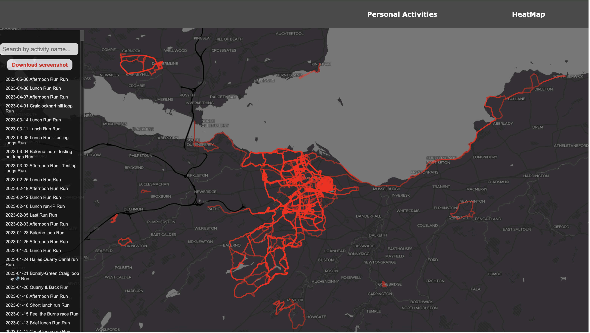

#  Strava Personal Dashboard

### This application is built using 
- React
- React-Map-gl & React Leaflet
- Turfjs
- Chartjs & Nivo
- Styled Components & styled-icons

### Dependencies  
- Turfjs
- Chartjs & Nivo
- Styled Components

- axios, mapbox-gl, react router,

##### Authorization Code flow 
* This application uses the Authorization code workflow (OAuth2.0) - see for more info https://developers.strava.com/docs/authentication/#introduction

## Installation
 
Clone the repository and install its dependencies running:

    $ npm install at both the root folder
    $ npm start thereafter from the root folder to run
    Note: after being directed to the Strava login you will be asked to authorise the application

  

  
 

https://github.com/DJMF2015/strava-personal-dashboard/assets/14128581/f2b9a787-ac7b-46ab-846b-a0356187a191

https://github.com/DJMF2015/strava-personal-dashboard/assets/14128581/68b44145-b5db-40b7-90a9-95542d1de157

##### TO-DO  
