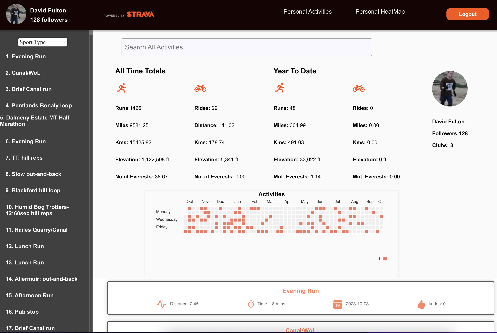

#  Strava Personalised Dashboard

View project at:
<https://runolution.vercel.app/>

### This application is built using 
- React
- Mapbox-gl & React Leaflet
- Chartjs
- Styled Components & Styled-icons

## Installation
 
Clone the repository and install its dependencies running:

    $ npm install at the root folder
    $ npm start thereafter from the root folder to run
    Note: after being directed to the Strava login you will be asked to authorise the application

  

  

  

  
 

 

https://github.com/DJMF2015/strava-personal-dashboard/assets/14128581/664be2b6-feaa-4e8c-9393-3ab28826a603

https://github.com/DJMF2015/strava-personal-dashboard/assets/14128581/2313fd0e-a71c-4ef8-a40c-45cebed61c6c
