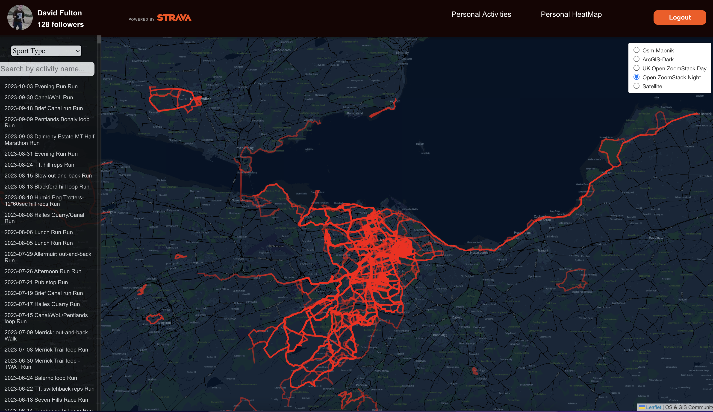

 
 #  Strava Personal Dashboard

### This application is built using 
- React
- React-Map-gl & React Leaflet

### Dependencies:  
-  axios, react-map-gl, styled-icons, styled components, html-to-image, react router

##### Authorization Code flow 
* This application uses the Authorization code workflow (OAuth2.0) - see for more info https://developers.strava.com/docs/authentication/#introduction

## Installation
 
Clone the repository and install its dependencies running:

    $ npm install at both the root folder
    $ npm start thereafter from the root folder to run
    Note: after being directed to the Strava login you will be asked to authorise the application

  

  
 

##### TO-DO  
 - Clean-up styling and refactor inline and css-in-jsx to styled components
 - 

 
 
